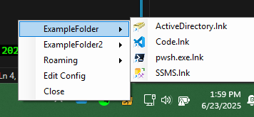

# QuickShortcutList
## Description
Windows 11 no longer allows pinning a folder to the taskbar. This feature was supported in most previous versions of Windows - most recently Windows 10 - and was removed from 11. Adding the folder to the taskbar allowed for quick access to the contents of a folder and was extremely useful for quick access shortcuts without having to open the Start menu.

QuickShortcutList is a lightweight system tray application that provides quick access to your favorite directories and their contents through a customizable menu. This is more extensible than the previous versions of Windows allowed since you can now customize a list of folders to display.



## Building/Compiling
This was developed in VSCode, but should work in VisualStudio as well. Build the QuickShortcutList.csproj to compile the application.

## Running
After [building/compiling](#buildingcompiling), run the QuickShortcutList.exe. Optionally, add the resulting executable to your startup folder to have it run on startup. This can be done by pressing `Win+R` and typing `shell:startup` and pressing enter. Then, copy the executable or create a shortcut in the folder that opens.

## Configuration
QuickShortcutList is configured using a `config.yaml` file located in the same directory as the application. The configuration file supports the following settings:

### Configuration Options

| Option | Description | Default |
|--------|-------------|---------|
| `Folders` | List of directories to include in the menu | None |
| `MaxDepth` | Maximum folder depth to display in the menu | 2 |
| `SortFoldersAlphabetically` | Whether to sort top-level folders alphabetically | `true` |

### Example Configuration

```yaml
Folders:
  - '%APPDATA%'
  - 'C:\Projects'
  - '%USERPROFILE%\Documents'
MaxDepth: 3
SortFoldersAlphabetically: true
```

## Publishing a Release
These steps will create a GitHub release with the version number selected. The source code and a compiled version of the application will all be linked to the release.

1. Find the current tags within the repo
```PowerShell
# List current tags
git tag -l
```

2. Determine if this is a `Major.Minor.Patch` increase and select the next version number accordingly
3. Update the `$version` value below with the new `Major.Minor.Patch` and run
```PowerShell
$version = 'v1.0.0'
git tag -a $version -m "Initial release $version"
git push origin $version
```

## TODO
- [ ]: determine how to add release notes instead of just saying "look at the commits"
- [ ]: Consider update alter functionality to check for new GH releases and prompt the user to update